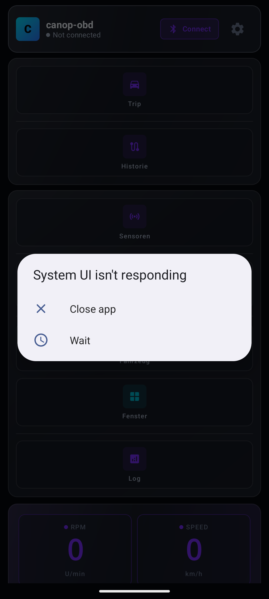
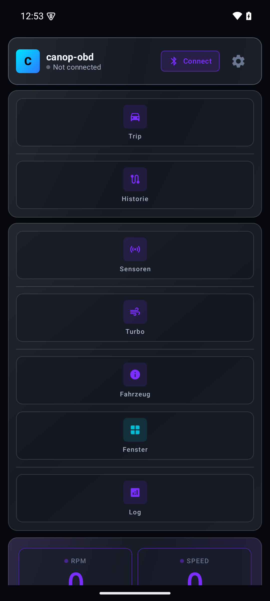
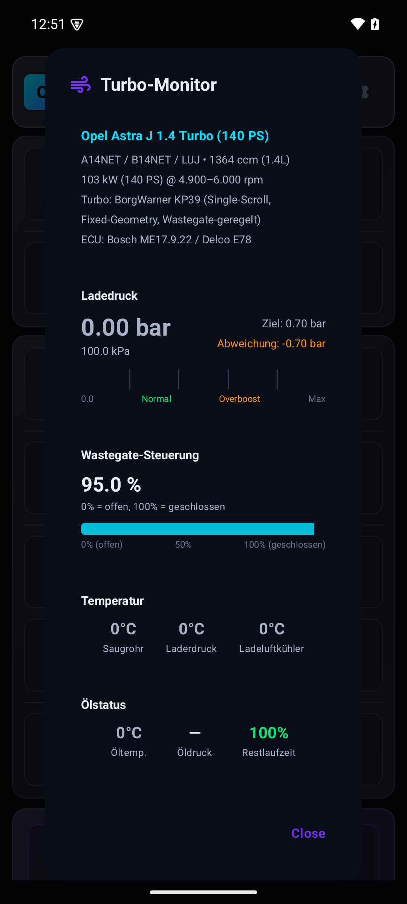
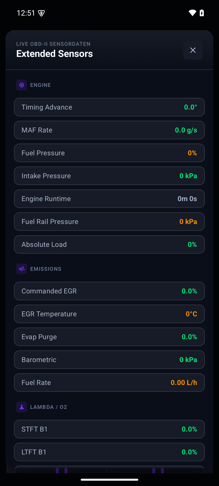
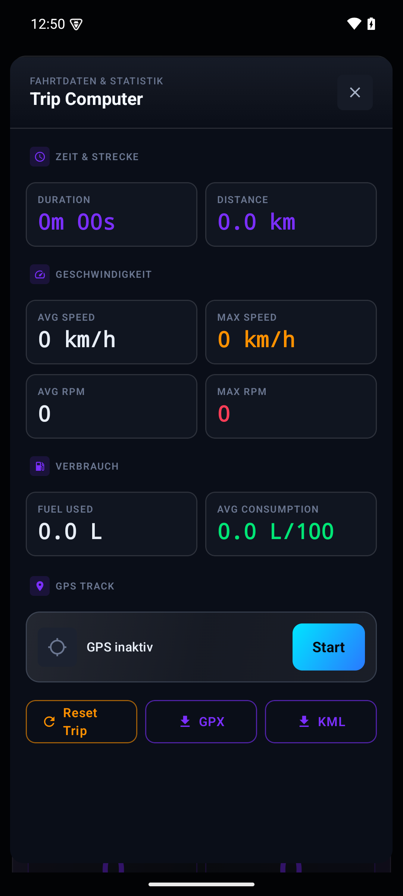
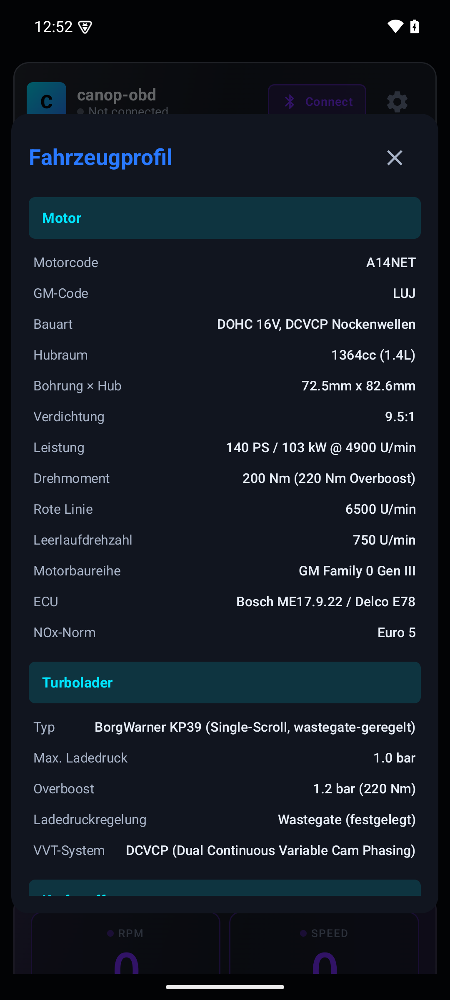
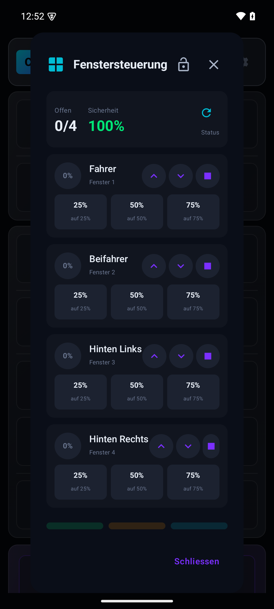
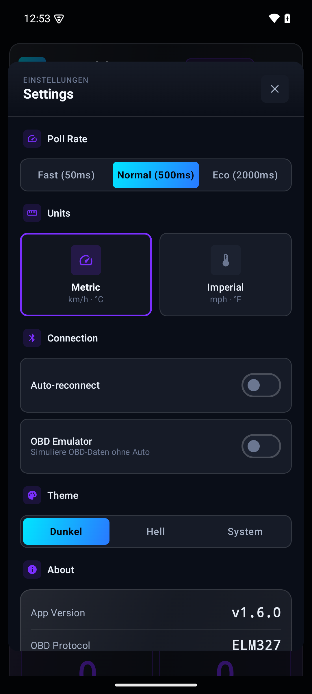

<h1 align="center">canop-obd</h1>

<p align="center">
  <strong>OBD-II Diagnose-App für Opel Astra J 1.4 Turbo (A14NET)</strong><br>
  Android · Kotlin · Jetpack Compose · Material Design 3
</p>

<p align="center">
  
  
  
  
  
  
</p>

---

## Über die App

canop-obd ist eine umfangreiche OBD-II Diagnose-App, speziell optimiert für den **Opel Astra J (2012–2015) mit 1.4 Turbo Benzinmotor (A14NET/LUJ, 140 PS)**. Die App bietet über 60 Funktionen – von Live-Dashboard über Turbo-Monitoring bis hin zur Komfort-Steuerung.

**Fahrzeug:** Opel Astra J 1.4 Turbo (A14NET) · 140 PS / 103 kW · 200 Nm · BorgWarner KP39 Turbolader · M32 6-Gang Getriebe · Bosch ME17.9.22 ECU

---

## Screenshots

<p align="center">
  
  
  
  
</p>
<p align="center">
  
  
  
  
</p>

---

## Features

### Dashboard
- **3 primäre Rundinstrumente** – konfigurierbar (RPM, Geschwindigkeit, Ladedruck, etc.)
- **6 sekundäre Kompaktinstrumente** – alle wichtigen Sensoren auf einen Blick
- **Dynamische Farbcodierung** – Grün → Gelb → Orange → Rot basierend auf Schwellwerten
- **Kritische Warnungen** – Hintergrund wechselt bei Überhitzung, Redline oder Überladung
- **Verbindungsqualität** – Echtzeit-Anzeige (Excellent / Good / Fair / Poor)
- **Dark/Light/System Theme** – 4 Farbthemen (Canopo, Blue Steel, Amber, Neon)

### Turbo-Monitoring
- **Ladedruck** – Ist/Soll-Vergleich mit Boost-Delta-Analyse
- **Wastegate-Position** – Duty Cycle mit Gesundheitsanzeige (0–100 Score)
- **Turbo-Drehzahl** – RPM-Anzeige mit Warnzonen (bis 200.000 RPM)
- **Ladelufttemperatur** – Intercooler-Effizienz-Berechnung
- **Abgastemperatur (EGT)** – Peak-Tracking, Verlaufsgraph
- **Boost-Leck-Erkennung** – automatische Effizienz-Analyse
- **Turbo-Cooldown-Timer** – Schutz des Turboladers nach Fahrten
- **Überladung-Warnung** – sofortige Warnung bei >1,35 bar

### Getriebe (M32)
- **Gang-Erkennung** – automatisch basierend auf RPM/Geschwindigkeit
- **Übersetzungsverhältnisse** – M32: 3.727 / 2.044 / 1.357 / 1.034 / 0.825 / 0.667
- **Schaltpunkt-Empfehlung** – basierend auf Drehmomentkurve (200 Nm @ 1850–4900)
- **Getriebeöl-Temperatur** – mit Warnzonen (>80 °C Warnung, >100 °C kritisch)

### Motor-Analyse
- **Kraftstofftrim-Analyse** – STFT/LTFT mit Mager/Fett-Erkennung
- **Steuerketten-Monitor** – Kaltstart-Rattern-Erkennung, Phasenanalyse
- **Ölzustands-Monitor** – temperaturbasierte Öl-Lebensdauer-Schätzung
- **PCV-System-Monitor** – Unterdruck- und Ölverbrauchsanalyse
- **Batterie-Health** – Spannungsverlauf mit Lichtmaschine-Analyse
- **Lambda/O2-Sensoren** – Spannungsanalyse B1S1, B1S2
- **Emissions-Readiness** – alle 11 Monitor-Tests (KAT, O2, EVAP, EGR, etc.)
- **Leerlauf-Analyse** – RPM-Stabilität und Gemisch-Regelung

### Kraftstoffverbrauch
- **Verbrauch L/100 km** – Echtzeit und Durchschnitt (MAF-basiert)
- **Reichweite** – Berechnung mit 56 L Tank und Reserve
- **Kraftstoffkosten** – editierbarer Preis, Tages-/Wochen-/Monats-/Jahres-Kosten
- **CO₂-Emissionen** – pro km, tripbasiert, Jahresprognose
- **ECO-Score** – gewichtete Analyse (35 % Effizienz, 25 % Glätte, 20 % Cruising, 20 % Momentum)
- **Optimierungstipps** – kontextbezogene Empfehlungen

### Wartungsmanagement
- **10 Service-Intervalle** spezifisch für A14NET:
  - Ölwechsel (Dexos2 5W-30, 4,5 L, 15.000 km)
  - Zahnriemen (150.000 km / 10 Jahre)
  - Getriebeöl (75W-80 GL-4, 2,7 L, 60.000 km)
  - Zündkerzen (NGK LZKR6B-10E, 30.000 km)
  - Bremsbeläge V/H, Luftfilter, Kühlmittel, Turbo-Inspektion
- **Fortschrittsbalken** – farbcodiert (Grün / Gelb / Rot)
- **Kostenschätzung** – DIY vs. Werkstatt
- **Erinnerungsfunktion** – konfigurierbare Switches

### Komfort-Steuerung
- **Zentralverriegelung** – Ver-/Entriegeln
- **Fensterheber** – 4 einzeln + alle hoch/runter
- **Außenspiegel** – einklappen/ausklappen/Spiegelheizung
- **Scheibenheizung** – Frontscheibe/Heckscheibe/Lenkrad
- **Beleuchtung** – Ambiente (10 Stufen), Coming/Leaving Home, Eckenlicht, DRL
- **Scheibenwischer** – 4 Stufen + Auto

### Sicherheitssysteme
- **Radgeschwindigkeiten** – 4-Kanal mit Differenzerkennung
- **ESP/ABS** – Statusanzeige (OK / Warnung / Fehler / Unbekannt)
- **Bremsverschleiß** – vorne/hinten mit Fortschrittsbalken
- **TPMS** – Reifendrucküberwachung (PSI)
- **Airbag-Status** – 6 Airbags (Fahrer/Beifahrer/Seite/Vorhang)

### Diagnose
- **71+ DTCs** – Astra-J-spezifische Fehlercodes mit Beschreibung, Schweregrad, Ursache, Lösung und Kostenschätzung
- **Freeze Frames** – Sensordaten zum Fehlerzeitpunkt
- **Protokoll-Erkennung** – ISO 15765-4 CAN (11bit/29bit, 250k/500k)

### Daten & Export
- **Datenlogging** – CSV-Aufzeichnung aller Sensordaten
- **GPS-Tracking** – GPX/KML Export
- **Trip-Computer** – Strecke, Dauer, Verbrauch, Max-Speed
- **Trip-Historie** – alle Fahrten mit Statistiken
- **Live-Trend-Graph** – Echtzeit-Verlauf (RPM, Speed, Boost, EGT, etc.)
- **Fernzugriff** – TCP-Server für Live-Daten über WLAN

### Performance
- **0–100 / 0–200 / 100–200 km/h** – Beschleunigungstests mit Historie
- **Leistungsrechner** – PS und Nm aus MAF und RPM
- **Drive-Score** – Fahrstilbewertung (A+ bis F)
- **Shift-Light** – konfigurierbare Schaltanzeige

### Astra J Codierung
- **BCM-Codierungen** – Zentralverriegelung, Fensterkomfort, Spiegel
- **UEC-Codierungen** – Tagfahrlicht (5 Varianten), Coming/Leaving Home
- **Versteckte Features** – Needle Sweep, Baron Mode, ESP Sport, DRL

---

## GM Mode 22 PIDs

Zusätzlich zu Standard OBD-II (Mode $01) werden **16 GM-spezifische DIDs** (Mode $22) unterstützt:

| DID | Name | Einheit |
|-----|------|---------|
| 221001 | Motor-Drehmoment | % |
| 221002 | Angefordertes Drehmoment | % |
| 221008 | Boost-Druck Ist | kPa |
| 221009 | Boost-Druck Soll | kPa |
| 22100A | Wastegate-Position | % |
| 22100B | Turbo-Drehzahl | rpm |
| 22100C | Motoröl-Temperatur | °C |
| 22100D | Kühlmittel-Temperatur | °C |
| 22100E | Ansaugluft-Temperatur | °C |
| 22100F | Einspritzdruck | kPa |
| 221010 | Einspritzdauer | ms |
| 221015 | VVT-Ansaugseite | ° |
| 221016 | VVT-Auslassseite | ° |
| 221018 | Kraftstoffverbrauch aktuell | L/h |
| 22101A | Kraftstoffverbrauch Durchschnitt | L/100km |
| 22101F | Luft-Kraftstoff-Verhältnis | – |

---

## Standard OBD-II PIDs (Auszug)

| PID | Name | Einheit | Formel |
|-----|------|---------|--------|
| 010C | Motordrehzahl | rpm | `(A*256+B)/4` |
| 010D | Fahrzeuggeschwindigkeit | km/h | `A` |
| 0105 | Kühlmitteltemperatur | °C | `A-40` |
| 0104 | Motorlast | % | `A*100/255` |
| 010F | Ansauglufttemperatur | °C | `A-40` |
| 0111 | Drosselklappenstellung | % | `A*100/255` |
| 012F | Kraftstofffüllstand | % | `A*100/255` |
| 010E | Zündzeitpunkt | ° | `A/2-64` |
| 0110 | MAF Luftmassenstrom | g/s | `(A*256+B)/100` |
| 0142 | Steuergerätespannung | V | `(A*256+B)/1000` |
| 015C | Motoröl-Temperatur | °C | `A-40` |
| 0170 | Ladedruck | kPa | `(A*256+B)*0.03125` |
| 0178 | Abgastemperatur B1 | °C | `(A*256+B)/10-40` |
| ATRV | Batteriespannung | V | direkt |

---

## Setup

### Voraussetzungen
- Android Studio Hedgehog (2023.1.1) oder neuer
- JDK 17
- Android SDK 35 (compileSdk)
- minSdk 26 (Android 8.0)
- ELM327 Bluetooth OBD-II Adapter (empfohlen: OBDLink MX+ oder STN-basiert)

### Build

```bash
git clone https://github.com/hendr15k/canop-obd.git
cd canop-obd
./gradlew assembleDebug
```

APK: `app/build/outputs/apk/debug/app-debug.apk`

### Installation

```bash
adb install app/build/outputs/apk/debug/app-debug.apk
```

### Adapter koppeln

1. Android → Einstellungen → Bluetooth
2. ELM327 Adapter suchen und koppeln (PIN oft `1234` oder `0000`)
3. App öffnen → Bluetooth-Icon → Gerät auswählen

---

## Architektur

```
app/src/main/java/com/canopobd/
├── MainActivity.kt                  # Entry point + State bindings
├── bluetooth/
│   ├── ELM327BTConnection.kt        # Bluetooth SPP + ELM327 AT commands
│   ├── Mode22Connection.kt          # GM Mode 22 Extended PIDs
│   └── RemoteBridge.kt              # TCP-Server für Fernzugriff
├── data/
│   ├── model/
│   │   ├── OBDModels.kt             # 65+ OBD PIDs, OBDData, Kalibrierung
│   │   ├── AstraJCodingModels.kt    # BCM/UEC/REC Codierungen
│   │   ├── AstraJDTCCodes.kt        # 71+ DTCs mit Kosten/Lösungen
│   │   ├── ExtendedGMMode22.kt      # 16 GM Mode 22 DIDs
│   │   ├── SafetyModels.kt          # ESP/ABS/TPMS/Airbag Datenmodelle
│   │   ├── EcoScoreModels.kt        # ECO-Score, CO₂, Kraftstoffkosten
│   │   ├── FuelModels.kt            # Kraftstoffanalyse
│   │   └── CarProfile.kt            # Fahrzeugprofile
│   ├── domain/                      # 29 Analyzer
│   │   ├── TurboSpoolAnalyzer.kt
│   │   ├── BoostLeakDetector.kt
│   │   ├── WastegateHealthAnalyzer.kt
│   │   ├── FuelTrimAnalyzer.kt
│   │   ├── BatteryHealthAnalyzer.kt
│   │   ├── SensorValidator.kt
│   │   ├── M32GearboxMonitor.kt
│   │   ├── DriveScoreCalculator.kt
│   │   └── ... (21 weitere)
│   ├── maintenance/
│   │   ├── AstraJ14TurboMaintenanceData.kt
│   │   ├── MaintenanceScheduler.kt
│   │   └── PartDatabase.kt
│   ├── repository/
│   │   ├── OBDRepository.kt         # Single source of truth
│   │   ├── CANRepository.kt         # CAN-BUS Daten
│   │   └── UDSRepository.kt         # UDS Diagnose
│   └── protocol/
│       ├── CANMonitor.kt            # CAN-BUS Monitor
│       ├── UDSClient.kt             # UDS Diagnoseclient
│       └── Mode22Client.kt          # Mode 22 Client
├── viewmodel/
│   ├── DashboardViewModel.kt        # MVVM Haupt-ViewModel
│   ├── TurboViewModel.kt            # Turbo-Monitoring
│   ├── SafetyViewModel.kt           # ESP/ABS/TPMS
│   ├── EcoScoreViewModel.kt         # ECO-Score + CO₂
│   └── AstraJCodingViewModel.kt     # Codierung
└── ui/                              # 38 Compose-Screens
    ├── theme/                       # Material 3 (4 Themes, Dark/Light)
    ├── components/                  # CircularGauge, CompactGauge, TrendGraph
    ├── dashboard/                   # Haupt-Dashboard
    ├── turbo/                       # Turbo-Monitor + Extended Turbo
    ├── gearbox/                     # M32 Getriebe-Monitor
    ├── comfort/                     # Komfort-Steuerung
    ├── safety/                      # Sicherheitssysteme
    ├── fuel/                        # Kraftstoffverbrauch
    ├── maintenance/                 # Wartungsmanagement
    ├── coding/                      # Astra J Codierung
    ├── dtc/                         # Diagnosefehler
    ├── tripcomputer/                # Trip-Computer
    ├── performance/                 # Beschleunigungstests
    └── ... (25 weitere)
```

**Statistik:** 153 Kotlin-Dateien · 78.197 Zeilen Code · 18 Unit-Test-Dateien · 20 Dokumentationen

---

## ELM327 Initialisierung

| Befehl | Funktion |
|--------|----------|
| `ATZ` | Reset |
| `ATE0` | Echo aus |
| `ATL0` | Linefeed aus |
| `ATS0` | Spaces aus |
| `ATH0` | Headers aus |
| `ATSP0` | Automatische Protokollerkennung |
| `ATAT1` | Adaptive Timing an |

---

## Empfohlene Adapter

| Adapter | Chip | Empfehlung |
|---------|------|------------|
| OBDLink MX+ | STN2120 | **Beste Wahl** – schnell, stabil, Mode 22 |
| Vgate iCar Pro | ELM327 v2.2 | Gut – zuverlässig |
| ELM327 Clone | ELM327 v1.5 | OK – langsamer, eingeschränkt |

> **Hinweis:** GM Mode 22 DIDs funktionieren nur mit STN-basierten Adaptern (OBDLink) oder speziellen ELM327 v2.2+ Chips.

---

## Technische Daten (A14NET)

| Parameter | Wert |
|-----------|------|
| Motorcode | A14NET (GM: LUJ) |
| Hubraum | 1.364 cm³ (1.4L) |
| Leistung | 140 PS (103 kW) @ 4.900–6.000 rpm |
| Drehmoment | 200 Nm @ 1.850–4.900 rpm |
| Turbo | BorgWarner KP39 (Single-Scroll, Wastegate) |
| Verdichtung | 9,5:1 |
| ECU | Bosch ME17.9.22 / Delco E78 |
| Kraftstoff | Super 95 RON (98 empfohlen) |
| Tank | 56 Liter |
| Getriebe | M32 6-Gang manuell |
| 0–100 km/h | 9,9 s |
| Vmax | 207 km/h |
| Verbrauch | 5,9 L/100km (NEFZ kombiniert) |
| CO₂ | 139 g/km |
| Öl | Dexos2 5W-30, 4,5 L |
| Emission | Euro 5 |

---

## Qualitätssicherung

```bash
./gradlew ktlintCheck    # Code-Formatierung (strict)
./gradlew detekt         # Statische Analyse
./gradlew test           # Unit Tests
```

---

## Download

Debug APK von GitHub Actions: **Artifact `canop-obd-debug-apk`**

---

## Contributing

1. Fork erstellen
2. Feature-Branch (`git checkout -b feature/amazing-feature`)
3. Commit (`git commit -m 'Add amazing feature'`)
4. Push (`git push origin feature/amazing-feature`)
5. Pull Request öffnen
